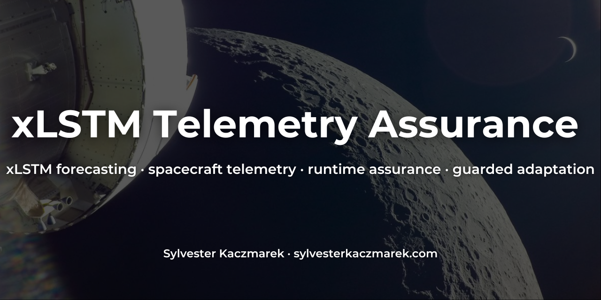
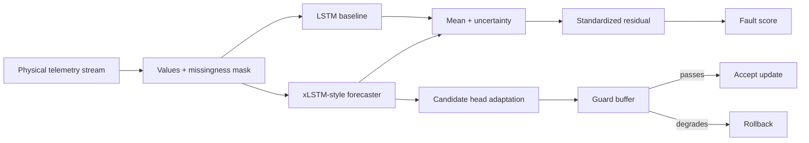

# xLSTM Telemetry Assurance



[](https://github.com/sylvesterkaczmarek/xlstm-telemetry-assurance/actions/workflows/ci.yml)


Controlled PyTorch experiments testing whether an xLSTM-style streaming forecaster can provide useful prediction and runtime-assurance signals under telemetry faults, distribution shift and guarded adaptation. Spacecraft telemetry is the flagship physical-system track, with robotics used as a transfer test.

The project deliberately sits between fundamental sequence modelling and physical-world autonomy. It does not turn a generic forecasting demo into a "space AI" project by relabelling the data. The benchmark makes physical-system constraints part of the experiment: missing telemetry, sensor corruption, slow drift, abrupt regime changes, uncertainty calibration, online adaptation and rollback.

## At a glance



## Project overview

- **Spacecraft track:** coupled power, thermal, reaction-wheel, pointing and payload telemetry.
- **Robotics track:** joint motion, motor current and temperature, vibration and tool load.
- **Faults:** packet loss, spikes, stuck sensors, gradual drift, regime shift and a mixed-fault stream.
- **Forecasting:** ordinary LSTM versus a compact stabilized xLSTM/sLSTM-style recurrent model.
- **Uncertainty:** per-channel Gaussian mean and predictive scale trained with negative log-likelihood.
- **Runtime assurance:** anomaly scores from uncertainty-normalized residuals plus explicit missingness.
- **Adaptation:** head-only candidate updates accepted only when a disjoint guard buffer does not degrade beyond tolerance.
- **Reproducibility:** deterministic generators, fixed seeds, CSV/JSON outputs, tests and CI.

## Why this is useful

A telemetry forecaster is more operationally useful when it can say both **what it expects next** and **how surprising the observation is**. That same signal can support fault detection, adaptation triggers and rollback decisions without requiring a separate opaque anomaly model.

The repository also tests whether the mechanism transfers between two different physical-system domains. The goal is not to claim that synthetic spacecraft or robot telemetry is flight-realistic. The goal is to expose the forecasting and assurance logic to structured physical dynamics and controlled failure modes that are easy to reproduce and inspect.

## xLSTMTime-style model

The central model uses a stabilized exponential-gating recurrent cell with a normalizer and log-space stabilizer. This keeps the xLSTM idea that input and forget gates can operate exponentially without allowing direct exponentials to dominate the recurrence.

A residual path carries the most recent normalized telemetry value into the forecast head. The probabilistic head predicts both mean and scale for every telemetry channel.

```python
m_new = torch.maximum(i_log, f_log + m)
i = torch.exp(torch.clamp(i_log - m_new, min=-20.0, max=0.0))
f = torch.exp(torch.clamp(f_log + m - m_new, min=-20.0, max=0.0))
c_new = f * c + i * z
n_new = f * n + i
normalized = c_new / torch.clamp(n_new, min=1e-6)
h_new = o * normalized
```

See [`src/xlstm_telemetry_assurance/models.py`](src/xlstm_telemetry_assurance/models.py).

## Experimental setup

The default benchmark runs three seeds. Each model is trained only on clean telemetry. A separate clean stream calibrates the anomaly threshold. The same model is then evaluated against six controlled fault conditions in both physical-system domains.

Forecast accuracy is measured against the known clean synthetic trajectory. Runtime anomaly scores, however, are computed only from telemetry that would actually be available to the system: uncertainty-normalized residuals against the observed measurement, with missing target channels excluded from the residual and missingness scored explicitly. The clean counterfactual is used only for benchmark evaluation and fault ground truth.

Guarded adaptation is evaluated separately. The benchmark exposes trusted clean targets only because this is a controlled synthetic experiment; real deployment would require an independent trusted guard signal.

## Results snapshot

The repository includes machine-readable results produced by the checked-in benchmark. See [`results/benchmark/summary.json`](results/benchmark/summary.json) and [`results/benchmark/metrics.csv`](results/benchmark/metrics.csv).

<!-- RESULTS_TABLE_START -->
| Domain | Model | Clean RMSE ↓ | 90% coverage | Mean fault F1 ↑ | Clean false-alarm rate | Parameters | CPU latency / step |
|---|---|---:|---:|---:|---:|---:|---:|
| Spacecraft | LSTM | **0.232 ± 0.003** | 0.996 | **0.236** | 0.0118 | 6,284 | **0.12 ms** |
| Spacecraft | xLSTM-style | 0.285 ± 0.007 | 0.995 | 0.233 | **0.0108** | **6,244** | 1.16 ms |
| Robotics | LSTM | **0.320 ± 0.007** | 0.986 | 0.216 | 0.0113 | 6,284 | **0.12 ms** |
| Robotics | xLSTM-style | 0.361 ± 0.012 | 0.980 | **0.217** | **0.0108** | **6,244** | 1.14 ms |

Values are means across three deterministic seeds. RMSE is measured in standardized telemetry units. CPU latency is hardware-dependent and is reported only for the machine used to generate the checked-in run.

**Forecasting result.** On this controlled benchmark, the ordinary LSTM has lower clean one-step RMSE in both physical-system tracks. The compact xLSTM-style recurrence uses slightly fewer trainable parameters, but it is slower in this straightforward Python recurrent implementation.

**Assurance result.** Once fault scores are computed from the observed telemetry available at runtime, neither recurrent model has a meaningful overall fault-detection advantage. Mean F1 is nearly identical in both domains. Packet loss is detected reliably because missingness is explicit, while value-only faults such as drift, stuck sensors and regime shifts remain difficult for this simple residual detector.

The guarded-adaptation controller accepted 9 of 12 candidate updates across the benchmark and rolled back the other 3 after guard loss worsened beyond tolerance. This demonstrates the rollback mechanism, not deployment-safe online learning.
<!-- RESULTS_TABLE_END -->


The benchmark is intentionally small. Its main result is methodological rather than architectural: forecast accuracy and residual-based assurance must be evaluated separately, and anomaly scoring must use only information available at runtime. The model comparison should not be treated as evidence that one architecture is generally superior for spacecraft or robotics telemetry.

## Quick start

```bash
git clone https://github.com/sylvesterkaczmarek/xlstm-telemetry-assurance.git
cd xlstm-telemetry-assurance
python -m venv .venv
source .venv/bin/activate
python -m pip install -e .[dev]
python -m pytest
python -m xlstm_telemetry_assurance.benchmark --output results/benchmark
```

For a faster pipeline check:

```bash
python -m xlstm_telemetry_assurance.benchmark --smoke --output results/smoke
```

## Outputs

```text
results/benchmark/
├── fault_detection_f1.png
├── metrics.csv
└── summary.json
```

`metrics.csv` retains per-seed measurements so aggregate numbers can be audited. `summary.json` contains the compact result used by the README.

## Repository layout

```text
xlstm-telemetry-assurance/
├── .github/workflows/ci.yml
├── assets/
│   └── social/
│       └── github-social-card-xlstm-telemetry-assurance.png
├── docs/
│   ├── findings.md
│   ├── method.md
│   ├── references.md
│   └── reproducibility.md
├── results/benchmark/
├── src/xlstm_telemetry_assurance/
│   ├── benchmark.py
│   ├── data.py
│   ├── metrics.py
│   ├── models.py
│   └── training.py
├── tests/
├── CITATION.cff
├── LICENSE
├── Makefile
├── pyproject.toml
├── requirements.txt
└── README.md
```

## Reproducibility and validation

- deterministic synthetic telemetry for each seed;
- explicit clean versus corrupted telemetry semantics;
- separate clean calibration stream;
- multiple benchmark seeds;
- model, metric, data and adaptation tests;
- lightweight end-to-end CI smoke run;
- machine-readable CSV and JSON results;
- no accelerator requirement.

See [`docs/reproducibility.md`](docs/reproducibility.md) and [`docs/findings.md`](docs/findings.md).

## What this repository does not claim

- The synthetic generators are not spacecraft or robotics digital twins.
- Forecast-residual anomaly detection is not sufficient mission assurance.
- Guarded adaptation assumes access to a trusted guard signal; the benchmark's clean counterfactual target is available only because the faults are synthetic.
- The compact recurrent cell is an xLSTM-style research implementation, not a drop-in copy of the official xLSTM library.
- Results on this benchmark do not establish general xLSTM superiority over LSTM, Transformers or time-series foundation models.
- Passing the benchmark is not evidence of flight readiness, functional safety certification or deployment security.

## Extending

Natural next steps include replacing the synthetic spacecraft track with publication-safe real mission telemetry, testing irregular sampling rather than fixed-rate masking, adding calibration methods for non-Gaussian residuals, and comparing against a modern pretrained time-series model under identical fault conditions.

## References

See [`docs/references.md`](docs/references.md) for the xLSTM and xLSTMTime papers that motivate the recurrent mechanism.

## Cite this repository

If you use or adapt this repository, please cite

> Kaczmarek, S. (2024). *xLSTM Telemetry Assurance*. GitHub. https://github.com/sylvesterkaczmarek/xlstm-telemetry-assurance

```bibtex
@software{Kaczmarek_2024_xLSTM_Telemetry_Assurance,
  author = {Sylvester Kaczmarek},
  title  = {{xLSTM Telemetry Assurance}},
  year   = {2024},
  url    = {https://github.com/sylvesterkaczmarek/xlstm-telemetry-assurance}
}
```

## License

MIT. See [LICENSE](LICENSE).

© **Sylvester Kaczmarek** · [https://www.sylvesterkaczmarek.com](https://www.sylvesterkaczmarek.com)
