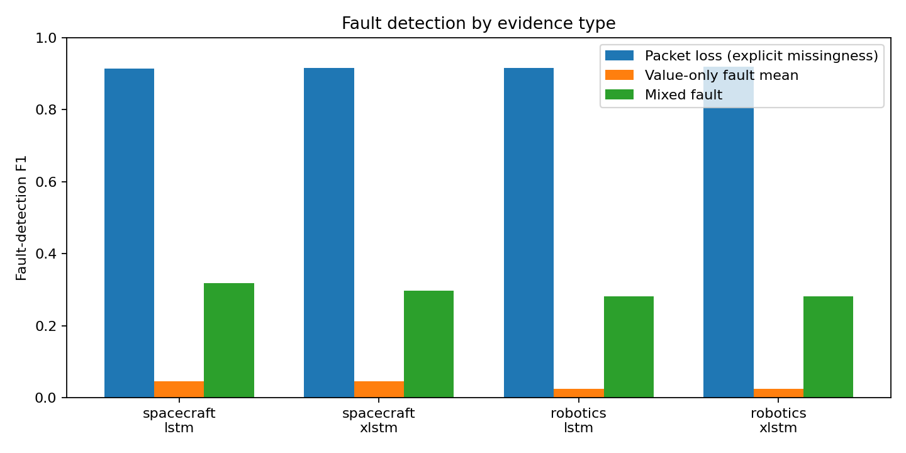

# xLSTM Telemetry Assurance


[](https://github.com/sylvesterkaczmarek/xlstm-telemetry-assurance/actions/workflows/ci.yml)


Controlled PyTorch experiments testing whether an xLSTM-style streaming forecaster can provide useful prediction and runtime-assurance signals under telemetry faults, distribution shift and guarded adaptation. Spacecraft telemetry is the flagship physical-system track, with robotics as a second benchmark domain. Models are trained separately for each domain.

The benchmark is intentionally small and inspectable. It uses structured synthetic telemetry rather than claiming flight-realistic or robot-deployment evidence.

## Project overview

- **Spacecraft track:** coupled power, thermal, reaction-wheel, pointing and payload telemetry.
- **Robotics track:** joint motion, motor current and temperature, vibration and tool load.
- **Faults:** packet loss, spikes, stuck sensors, gradual drift, regime shift and a mixed-fault stream.
- **Forecasting:** ordinary LSTM versus a compact stabilised xLSTM/sLSTM-style recurrent model.
- **Uncertainty:** per-channel Gaussian mean and predictive scale trained with negative log-likelihood.
- **Runtime assurance:** uncertainty-normalised residuals plus missingness from explicit masks or nonfinite readings.
- **Adaptation:** head-only candidate updates checked on a separate timeline segment, with complete restoration on rejection or failure.
- **Reproducibility:** fixed seeds, deterministic CPU settings, machine-readable provenance, tests and CI.

## Experimental setup

The default benchmark runs seeds `11`, `29` and `47`. Each model is trained on clean telemetry, a separate clean sequence calibrates the anomaly threshold, and a separate test sequence is evaluated under six controlled fault conditions.

Runtime residuals use the **observed telemetry available to the detector**. The clean counterfactual supplies benchmark error metrics, fault ground truth and supervised adaptation/guard targets. It does not supply the runtime detector’s residuals.

Packet loss is different from the value-only faults. Missing target channels are explicitly represented and receive a direct missingness score contribution. Packet-loss F1 therefore measures a detector with explicit missingness evidence, not purely learned residual anomaly detection. The mixed scenario contains both missingness and value corruption and is reported separately.

## Results snapshot

These results were regenerated after correcting the recurrent initialisation, numerical checks and adaptation split. Reported ± values are sample standard deviations across three seeds. They describe variation between these runs and are not confidence intervals.

Machine-readable results are in [`results/benchmark/summary.json`](results/benchmark/summary.json) and [`results/benchmark/metrics.csv`](results/benchmark/metrics.csv).

### Forecasting and host timing

| Domain | Model | Clean RMSE ↓ | 90% coverage | Clean Gaussian NLL ↓ | Parameters | Host CPU window latency |
|---|---|---:|---:|---:|---:|---:|
| Spacecraft | LSTM | **0.232 ± 0.003** | 0.996 | **0.494** | 6,284 | **0.16 ms** |
| Spacecraft | xLSTM-style | 0.285 ± 0.009 | 0.995 | 0.495 | **6,244** | 1.05 ms |
| Robotics | LSTM | **0.320 ± 0.009** | 0.986 | 0.575 | 6,284 | **0.14 ms** |
| Robotics | xLSTM-style | 0.361 ± 0.014 | 0.980 | **0.501** | **6,244** | 1.03 ms |

Latency is the mean wall-clock time for **one complete model forward pass over one 24-sample input window on the recorded host CPU**. It is hardware- and load-dependent. It is not recurrent-timestep latency, spacecraft or robot real-time timing, or WCET.

### Fault detection

| Domain | Model | Packet-loss F1 | Value-only F1 mean | Mixed F1 | Overall six-fault F1 | Clean false-alarm rate |
|---|---|---:|---:|---:|---:|---:|
| Spacecraft | LSTM | 0.913 | **0.046** | **0.318** | **0.236** | 0.0118 |
| Spacecraft | xLSTM-style | **0.916** | 0.046 | 0.298 | 0.233 | **0.0108** |
| Robotics | LSTM | 0.916 | 0.025 | 0.281 | 0.216 | 0.0113 |
| Robotics | xLSTM-style | **0.920** | **0.025** | **0.281** | **0.217** | **0.0108** |

The value-only mean covers `spike`, `stuck`, `drift` and `regime_shift`. Per-fault means are recorded in `summary.json`. The very low value-only F1 shows that this simple residual detector is weak on those faults despite strong packet-loss detection from the explicit missingness signal.

The guarded-adaptation experiment accepted 9 of 12 candidate updates and restored the original model for the other 3. The before/after losses in `metrics.csv` allow each decision to be checked.

The adaptation and guard segments now share no raw timestamps. Acceptance permits guard-loss degradation of at most `tolerance * abs(previous_loss)`, which handles negative Gaussian losses correctly. Rejection or an exception restores the original parameters and buffers; the caller’s training modes and frozen-parameter settings are preserved. The segments can still be temporally correlated, and their trusted clean targets are available because this benchmark is synthetic.



## Quick start

```bash
git clone https://github.com/sylvesterkaczmarek/xlstm-telemetry-assurance.git
cd xlstm-telemetry-assurance
python -m venv .venv
source .venv/bin/activate
python -m pip install -e ".[dev]"
python -m pytest
python -m xlstm_telemetry_assurance.benchmark --output results/benchmark
```

`pyproject.toml` is the authoritative dependency definition. For the pinned Python 3.12 reference environment used by CI:

```bash
python -m pip install -r requirements-reference.txt
python -m pip install --no-build-isolation --no-deps -e .
```

For a faster pipeline check:

```bash
python -m xlstm_telemetry_assurance.benchmark --smoke --output results/smoke
```

## Outputs

```text
results/benchmark/
├── fault_detection_f1.png
├── metrics.csv
├── run_environment.json
└── summary.json
```

`metrics.csv` retains per-seed scenario measurements and the guard loss before and after every candidate update, including rejected candidates. `summary.json` records aggregate forecasting, Gaussian NLL, packet-loss, value-only, mixed and per-fault metrics, together with timing semantics. `run_environment.json` records the executed package’s Git state when attributable, hashes of every Python source file, Python/platform/CPU information, package versions, benchmark configuration, deterministic settings and an overall SHA-256 fingerprint. Failed computation or serialisation preserves the previous result files.

## Reproducibility and validation

CI exercises Python 3.10–3.13 with compile checks, Ruff and the full test suite. Python 3.12 also checks the pinned reference environment and a complete smoke benchmark. A separate job builds the distributions, tests the installed wheel and runs it from outside the checkout. Benchmark runs use deterministic PyTorch algorithms and single-thread CPU execution where supported.

These controls improve repeatability but do not imply bit-for-bit identity across operating systems, CPU libraries, PyTorch builds or hardware.

See [`docs/reproducibility.md`](docs/reproducibility.md), [`docs/method.md`](docs/method.md) and [`docs/findings.md`](docs/findings.md).

## What this repository does not claim

- The synthetic generators are not spacecraft or robotics digital twins.
- Forecast-residual anomaly detection is not sufficient mission assurance.
- Packet-loss performance is not evidence of learned value-fault detection because missingness is explicit.
- Guarded adaptation assumes access to a trusted guard signal; the clean counterfactual target exists only because the benchmark is synthetic.
- The compact recurrent cell is an xLSTM-style research implementation, not a drop-in copy of the official xLSTM library.
- Host CPU window timing is not spacecraft or robot timing and is not WCET.
- Results do not establish general xLSTM superiority over LSTM, Transformers or time-series foundation models.
- Passing the benchmark is not evidence of flight readiness, functional safety certification or deployment security.

## References

See [`docs/references.md`](docs/references.md) for the xLSTM and xLSTMTime papers that motivate the recurrent mechanism.

## Cite this repository

> Kaczmarek, S. (2024). *xLSTM Telemetry Assurance*. GitHub. https://github.com/sylvesterkaczmarek/xlstm-telemetry-assurance

```bibtex
@software{Kaczmarek_2024_xLSTM_Telemetry_Assurance,
  author = {Sylvester Kaczmarek},
  title  = {{xLSTM Telemetry Assurance}},
  year   = {2024},
  url    = {https://github.com/sylvesterkaczmarek/xlstm-telemetry-assurance}
}
```

## License

MIT. See [LICENSE](LICENSE).

© **Sylvester Kaczmarek** · [https://www.sylvesterkaczmarek.com](https://www.sylvesterkaczmarek.com)
